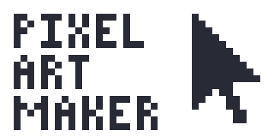
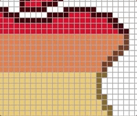
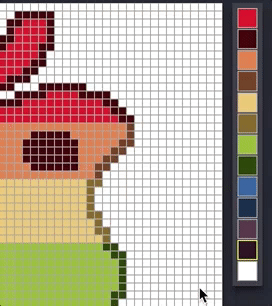
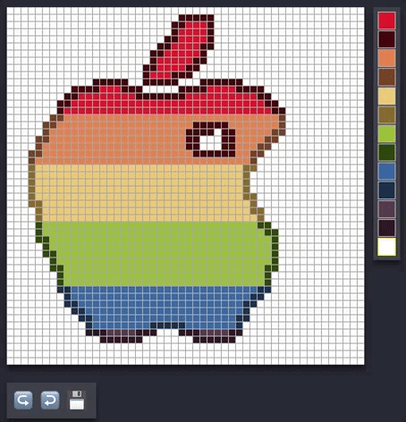
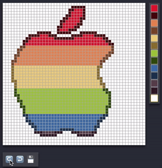

# PixelArtMaker
A Swift playground where you can make pixel art

# About:
Miss all the pixel perfect art that was popular in the 80's? If so, Pixel Art Maker is for you! Try and replicate old classics like [Mario](https://en.wikipedia.org/wiki/Mario) or freestyle your own art! This playground app is here to promote creativity, but also bring the warm and fuzzy nostalgia associated with old videogames. 😊

### Inspiration:
_Though I wasn't born in the 80's, growing up I was lucky enough to get my hands on old Nintendo games that have brought me joy my whole life!_

### Author:
[Ben Emdon 👨‍💻](https://github.com/BenEmdon)

# Features:
### Drawing 🖌

You can either do single clicks to change pixels or you can click and drag!

### Changing Color 🎨

Give the `CanvasController` an array of colors (`[UIColor]`) to setup your palette.

### Undo and Redo ↪️ ↩️

Hit the undo and redo buttons to undo and redo draws.

### Save 💾

Hitting the save button will make a pretty render of your art without the grid and save it.

# NOTES ABOUT SAVING ⚠️
In order to save your art you must ensure the following directory exists:

`/Users/{YOUR USER NAME}/Documents/Shared\ Playground\ Data`

---
